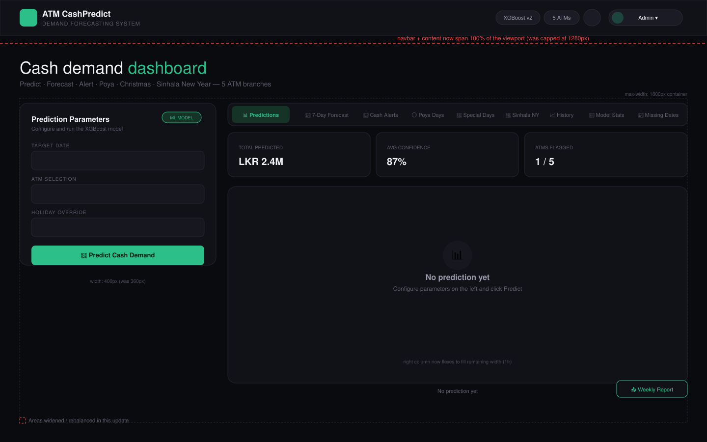

# ATM CashPredict — Final Year Project
**XGBoost Cash Demand Forecasting with Sri Lankan Holiday Intelligence**

---

## Dashboard Layout (Wireframe)



The dashboard uses a full-bleed navbar and a 2-column content grid that now scales
with the viewport instead of sitting inside a fixed `1280px` box:

| Region | Behavior |
|---|---|
| Navbar | Full width, sticky, `72px` tall |
| Content container | `max-width: 1800px`, centered, `40px` side padding |
| Left column — Prediction Parameters | Fixed `400px` (was `360px`) |
| Right column — Tabs + results | Fluid `1fr`, fills all remaining width |
| Tab bar / cards / empty state | Larger padding and type so content doesn't look stranded on wide screens |

Base type size was also bumped up a step across the navbar, form, tab bar, and
login screen for readability on large monitors. See `docs/dashboard_wireframe.svg`
for the annotated diagram.

---

## Quick Start

```bash
# 1. Install Python dependencies
pip install -r requirements.txt

# 2. Run data pipeline + train models (first time only)
python branch_notebooks/run_pipeline.py

# 3. Start Flask backend
python branch_backend/app.py

# 4. Start React frontend (new terminal)
cd branch_frontend/react_app
npm install
npm run dev

# Open: http://localhost:3000
# Login: admin / admin123
```

---

## Dashboard Tabs (9 total)

| Tab | Feature |
|---|---|
| 📊 **Predictions** | XGBoost single-day prediction with P10/P50/P90 bands |
| 📅 **7-Day Forecast** | Full week ahead — all ATMs, all flags auto-applied |
| 🚨 **Cash Alerts** | Enter loaded cash → get CRITICAL/WARNING/OK alerts |
| 🌕 **Poya Days** | Sri Lankan full-moon holidays — 2011 to 2035 |
| 🎄 **Special Days** | Christmas, New Year, Diwali demand prediction |
| 🌸 **Sinhala New Year** | April 14 five-day cluster prediction |
| 📈 **History** | 90-day withdrawal chart per ATM |
| 🤖 **Model Stats** | sMAPE vs baseline for all 5 ATMs |
| 📅 **Missing Dates** | 731 missing dates filled — view per ATM |

---

## Project Structure

```
atm_final/
├── branch_data/            ← raw CSV, processed CSV, feature engineering
├── branch_model/            ← trainer.py, evaluator.py, 5 saved .pkl models
├── branch_backend/          ← Flask app.py + 18 API routes + predictor.py
├── branch_frontend/         ← React app (13 components, login, auth)
├── shared/                  ← config.py, utils.py, poya.py, special_days.py
├── branch_notebooks/        ← run_pipeline.py
└── docs/                    ← dashboard_wireframe.svg / .png (layout reference)
```

---

## API Routes (18 total)

**Auth:** `/login` `/logout` `/me` `/health`
**Prediction:** `/predict` `/history` `/atm_stats` `/missing_dates`
**Poya:** `/poya/calendar` `/poya/check` `/poya/predict` `/poya/year_predictions`
**Special Days:** `/special/check` `/special/predict` `/special/christmas` `/special/sinhala_new_year` `/special/sinhala_predict`
**Forecast & Alerts:** `/forecast/week` `/alerts/cash_levels` `/alerts/check`

---

## Special Day Multipliers

| Event | Day | Multiplier |
|---|---|---|
| 🌕 Poya Day | Monthly | ×0.80 |
| 🌔 Pre-Poya | Day before | ×1.30 |
| 🌸 Sinhala NY Day | Apr 14 | ×0.75 |
| 🎉 Sinhala NY Eve | Apr 13 | ×1.40 |
| 🎄 Christmas Eve | Dec 24 | ×1.35 |
| 🎅 Christmas Day | Dec 25 | ×0.85 |
| 🎆 New Year Eve | Dec 31 | ×1.40 |
| 💰 Salary Day | 1st/last | ×1.22 |

---

## Security

This app was hardened against the most common issues in a hobby/demo Flask + React stack:

| Issue | Fix |
|---|---|
| Plain SHA-256 passwords, no salt | Passwords now hashed with `werkzeug.security` (PBKDF2-SHA256, 260k iterations, salted) |
| Hardcoded `secret_key` committed to source | Loaded from `FLASK_SECRET_KEY` env var; random fallback if unset |
| Tokens never expired | Tokens now expire after `TOKEN_LIFETIME_HOURS` (default 8h) and are checked on every request |
| No role enforcement | `viewer` can only **read** (predictions, history, calendars); `analyst`/`admin` can also **write** (run predictions, save cash levels, trigger forecasts/alerts) |
| No brute-force protection on login | `/login` is rate-limited to 5 attempts/minute per IP via Flask-Limiter |
| `debug=True` by default | Debug mode is **off** by default; only enabled if `FLASK_DEBUG=1` is explicitly set |

See `branch_backend/api/auth.py` for the implementation and `.env.example` for configurable settings.

**Still recommended before any real deployment:** move users to a real database, serve over HTTPS, and add an audit log of who changed cash levels or ran predictions.

## Login Credentials

| Username | Password | Role |
|---|---|---|
| admin | admin123 | 👑 Admin |
| analyst | analyst123 | 📊 Analyst |
| viewer | viewer123 | 👁 Viewer |

---

## Model Performance

| ATM | Zone | sMAPE | Improvement |
|---|---|---|---|
| Airport ATM | transport | 49.6% | +25.0% |
| Big Street ATM | commercial | 33.0% | +18.5% |
| Christ College ATM | educational | 44.7% | −4.4% |
| KK Nagar ATM | residential | 56.4% | +4.1% |
| Mount Road ATM | commercial | 69.6% | −17.4% |

---

## Tech Stack

**Backend:** Python · Flask · XGBoost · Pandas · NumPy · Joblib
**Frontend:** React 18 · Vite · Recharts · Axios
**Auth:** Token-based (X-Auth-Token header, localStorage)
**Data:** 12,320 rows · 5 ATMs · 2011–2017 · 731 missing dates filled
